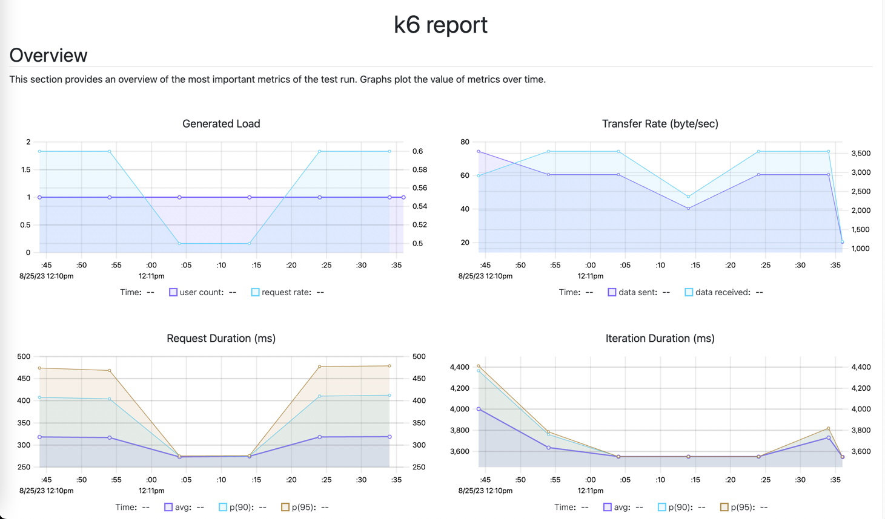

## Install

```shell
brew install k6
```

## Install xk6-dashboard

- https://k6.io/blog/ways-to-visualize-k6-results/
- https://github.com/grafana/xk6-dashboard

1. Download xk6:

```shell
go install go.k6.io/xk6/cmd/xk6@latest
```

2. Build the binary:

```shell
xk6 build --with github.com/grafana/xk6-dashboard@latest
```

Usage

```shell
./k6 run --out dashboard script.js
```

### Preview

